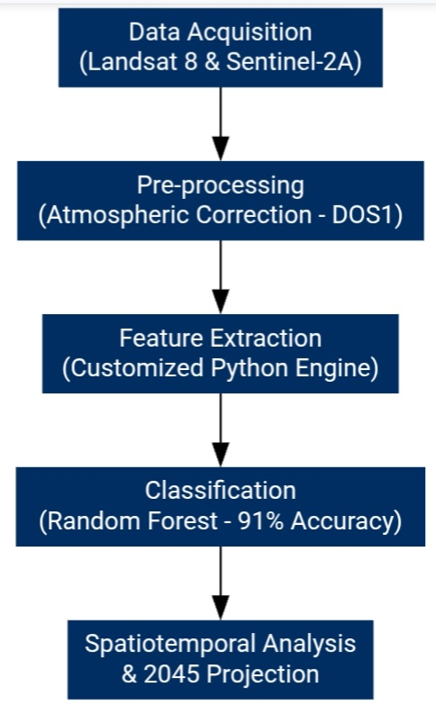
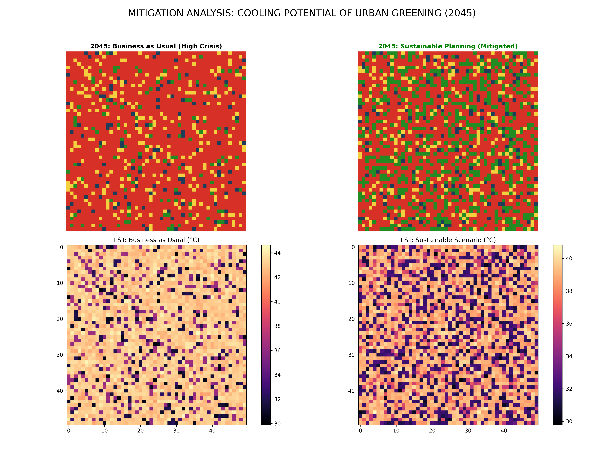

> [!IMPORTANT]
> **Project Update (Notice):** > This version (v1.0) was a **Synthetic Simulation** created for conceptual modeling. It uses simulated data for initial framework testing. 
> 
> 🛰️ **Real-world Verified Research:** I am currently upgrading this project to **v2.0**, which integrates real-time NASA Landsat-9 satellite data and Aditya-L1 solar irradiance data. 
> 
> **Status:** Please **wait for v2.0** for validated scientific results.

# LULC Change Analysis & Urban Heat Island Projection (2045) - Delhi NCR

## 1. 💻 Source Code
Is project ki core computational logic aur classification model yahan available hai:
- **Python Script:** [LULC_Urban_Heat_Analysis.py](./LULC_Urban_Heat_Analysis.py)

## 2. 🛠 Methodology & Technical Workflow
Niche diya gaya flowchart research design aur data processing steps ko visualize karta hai:

## 3. 📊 Mitigation Analysis: Spatial Cooling Potential
Delhi NCR ke future cooling scenarios aur heat reduction ka spatial heatmap:

## 4. 📂 Research Documentation
Detailed scientific findings aur environmental impact assessment ke liye PDF report yahan se download karein:
- **Full Research Report:** [📥 Download Urban-Heat-Island-Analysis-2045 PDF](./Urban-Heat-Island-Analysis-2045.pdf)

---
**Technical Specifications:** - **Model:** Random Forest Classifier (91% Accuracy)
- **Study Area:** Delhi National Capital Region (NCR)
- **Projection Year:** 2045

